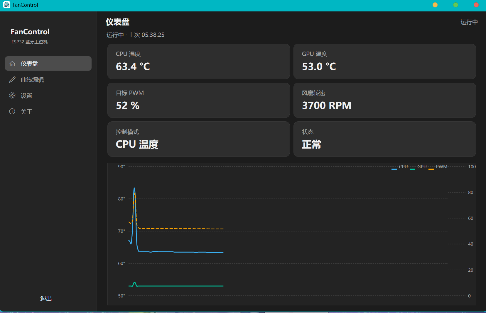
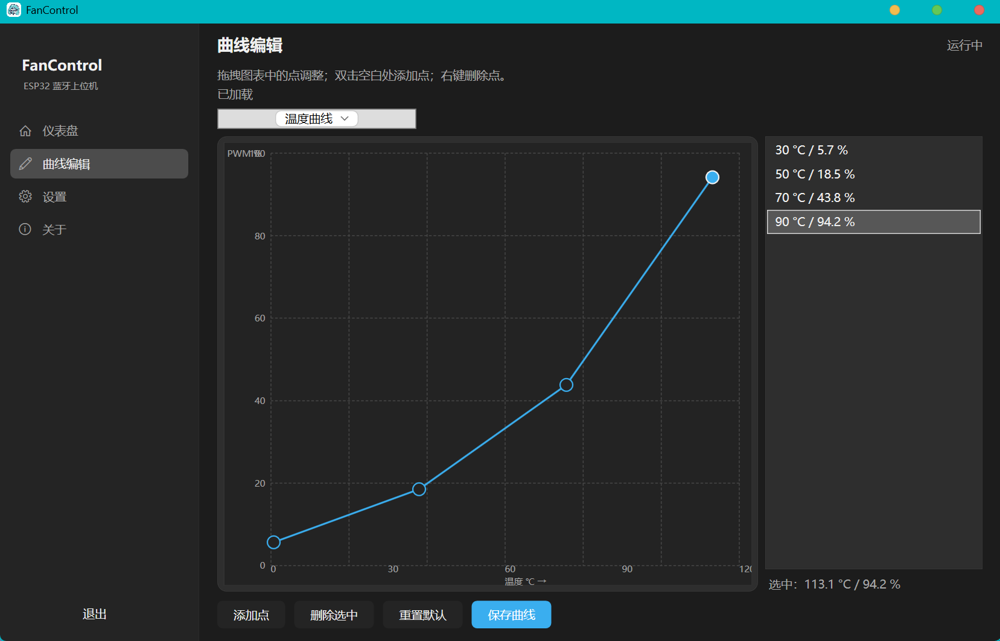
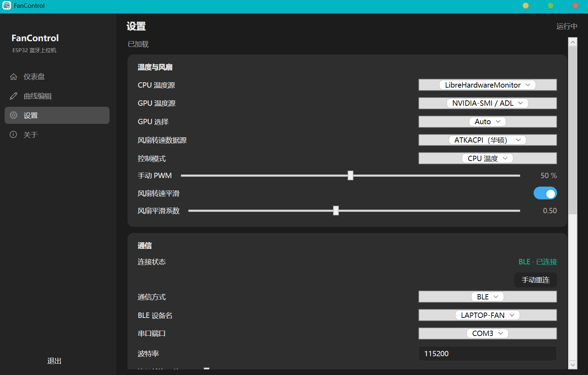
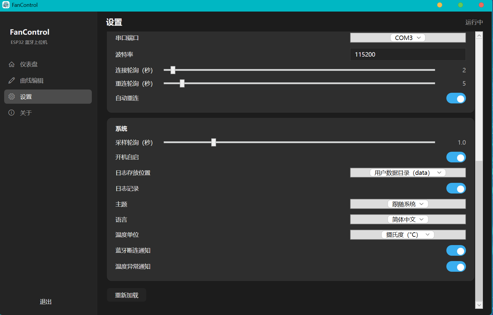

# FanControl

[English](README.en.md) | **中文**

> 本软件是 UP 主[垃圾研究社](https://www.bilibili.com/video/BV1Lr421M7u2/)开源硬件的**适配上位机**，并针对该硬件与**重写了一套固件和软件**，组成完整的笔记本风扇控制方案。

  

**上位机仓库**：[anlerway/Bluetooth-FanControl](https://github.com/anlerway/Bluetooth-FanControl)
**固件仓库**：[anlerway/ESP32-LaptopFan](https://github.com/anlerway/ESP32-LaptopFan)

## 下载

- **GitHub Releases**：<https://github.com/anlerway/Bluetooth-FanControl/releases/latest>
- 提供 **安装包**（带安装向导、快捷方式、卸载）与 **免安装 zip**（解压即用）两种形态；
- 每种形态分 **自带 .NET 运行库**（免装环境）与 **需 .NET 8 环境**（体积更小）两个版本；
- 如遇杀软误报，请加入白名单或关闭杀软；不信任发行版可自行克隆仓库编译。

## 界面预览

| 仪表盘 | 曲线编辑 |
| --- | --- |
|  |  |

| 设置 | 设置 |
| --- | --- |
|  |  |

## 简介

在垃圾研究社开源硬件的基础上，针对实际体验做了完整重制：

- **上位机**：WinUI 3 桌面程序，新增自动重连、开机自启、控制面板、更多更自由的温度源获取、可调节的温度-风扇曲线；

## 功能特性

### 上位机（软件）

- **多温度数据源**：LibreHardwareMonitor/ 华硕 ATKACPI / WMI / AIDA64 / NVIDIA-SMI / ADL ；
- **CPU / GPU 获取方式独立选择**，针对多GPU用户可自由选择GPU；
- **可调节温度-风扇曲线**：5 种控制模式（手动 / CPU 温度 / GPU 温度 / 混合取最高 / 混合平均 / 目标转速），温度曲线与转速曲线均可编辑，风扇曲线支持平滑；
- **自动重连**：BLE / COM 双通信链路，连接断开自动按轮询重连，支持手动重连；
- **开机自启**：开机直接驻留托盘，直接进行蓝牙连接；
- **控制面板**：实时温度 / PWM / 转速卡片 + 自绘趋势曲线（CPU/GPU/ PWM）；
- **托盘常驻**：托盘温度预览、断开/错误通知、关闭主窗口最小化到托盘；

## 软件设置

### 首次使用
- 不论是安装包版还是绿色版，启动前会提示选择用户数据存储位置，您可以选择放到 **安装目录** 或 **AppData** 目录。

### 开机自启与自动连接
- 建议打开 **开机自启**，下次启动电脑时会自动运行并控制风扇。
- 无论电脑与硬件设备谁先上线，软件均会在上线后自动连接，无需手动干预。

### 配置温度数据源
- 打开软件后，进入设置页面，选择合适的数据源（如 LibreHardwareMonitor、ATKACPI 等）。
- 华硕笔记本用户建议直接选择 **ATKACPI** 模式。
- 切换至仪表盘，直到温度数据正常输出。

### 控制模式
- 在设置或曲线编辑中选择合适的控制模式（手动、CPU温度、GPU温度、混合最高、混合平均、目标转速等）。
- 仪表盘会实时显示 PWM 输出和风扇曲线。

### 通信连接方式

#### BLE 低功耗蓝牙模式（推荐）
1. 设备上电后，会广播名为 `LAPTOP-FAN` 的蓝牙信号，使用电脑进行蓝牙配对。
2. 打开上位机软件，通信方式选择 **BLE**，设备名选择 `LAPTOP_FAN`，无需其他配置。
3. 稍等片刻即可连接成功，仪表盘正常显示数据。

#### 串口（COM）模式（不推荐）
1. 设备上电后，点击菜单键，将 `BT Mode` 切换为 `COM`，设备会自动重启并广播 `LAPTOP-FAN-COM` 的蓝牙信号。
2. 在电脑蓝牙中配对 `LAPTOP-FAN-COM`，系统会生成虚拟 COM 端口。
3. 打开上位机，通信方式选 **COM**，波特率 `115200`，选择对应的串口号。
4. 连接成功后，OLED 屏幕显示数据，仪表盘更新。

## 架构

单进程设计：UI（WinUI 3）与后台监控循环同进程运行，托盘为独立 STA 线程，退出时统一释放资源。

```text
FanControl.slnx
├── FanControl.Shared/    # 共享契约：Enums / Models（配置、数据包）
├── FanControl.Service/   # 类库：采样循环、硬件数据源、通信、配置、托盘
├── FanControl.UI/        # WinUI 3 主程序
├── FanControl.Installer/ # Inno Setup 安装脚本
├── tests/FanControl.Tests
└── docs/                 # 架构与通信协议文档
```

采样链路：`温度数据源（CPU/GPU 独立）→ 控制模式查曲线 → PWM 平滑 → BLE/COM 下发 → OLED 显示`。

## 环境配置

### 上位机

- Windows 10/11 x64；
- .NET 8 SDK（8.0.423+）——仅编译源码需要；
- Visual Studio 2026（含 WinUI 3 / Windows App SDK 工作负载）——仅构建主程序需要；
- Inno Setup 6（用于打安装包）。

## 构建

前置：.NET 8 SDK（8.0.423+）、Visual Studio 2026（WinUI 3 工作负载）。

```powershell
# 类库与测试
dotnet build FanControl.Shared
dotnet build FanControl.Service
dotnet test tests/FanControl.Tests

# 主程序（WinUI 3，非打包模式，x64；在 VS2026 开发人员命令提示符中执行）
msbuild FanControl.UI\FanControl.UI.csproj /restore /p:Configuration=Debug /p:Platform=x64

# 发布为自包含单进程 exe（免装 .NET）
msbuild FanControl.UI\FanControl.UI.csproj /restore /t:Publish /p:Configuration=Release /p:Platform=x64 /p:RuntimeIdentifier=win-x64 /p:WindowsAppSDKSelfContained=true /p:PublishDir=artifacts\exe\FanControl
```

## 运行

直接运行 [artifacts\exe\FanControl\FanControl.exe](artifacts/exe/FanControl/FanControl.exe)，或使用桌面发行版的安装包/免安装 zip：

- 主窗口：仪表盘（实时温度/趋势）、设置、曲线编辑器；
- 托盘：打开主界面 / 开机自启 / 退出；关闭主窗口 = 最小化到托盘，后台监控继续；
- 手动启动会请求管理员权限（访问硬件传感器），开机自启通过任务计划以最高权限静默运行。

> Service 为纯类库，以用户级权限运行，不需要额外安装服务。

## 数据源说明

| 数据源 | 说明 |
| --- | --- |
| LibreHardwareMonitor | 默认，真实硬件传感器（CPU Package/Tctl/Tdie、GPU 温度、风扇转速） |
| ATKACPI | 华硕机型专用（参考项目G-Helper） |
| WMI | MSAcpi_ThermalZoneTemperature 热区温度 |
| AIDA64 | 注册表 SensorValues（需 AIDA64 开启“允许监控数据写入注册表”） |
| NVIDIA-SMI / ADL | GPU 专用链路：NVIDIA 官方工具 → AMD 驱动库 |

## 通信协议

一行 ASCII 文本帧，`\r\n` 结尾：

- 上位机 → 固件：`PWM:<0-100>`、`TIME:yyyy/MM/dd HH:mm:ss`、`TEMP:<cpu>[,<gpu>]`；
- 固件 → 上位机：`READY`（连接握手）、`STATUS:...`（查询应答）。

## 参考与开源硬件

| 项目 | 说明 | 链接 |
| --- | --- | --- |
| 垃圾研究社 | 适配的硬件开源方案 | <https://www.bilibili.com/video/BV1Lr421M7u2/> |
| G-Helper | 华硕设备控制参考 | <https://github.com/seerge/g-helper> |
| LibreHardwareMonitor | 硬件监控库 | <https://github.com/LibreHardwareMonitor/LibreHardwareMonitor> |

## 免责声明

风扇控制涉及硬件散热，请谨慎调节转速曲线；固件/上位机按现状提供，使用风险自负。
如果遇到报毒，请加入白名单或关闭杀软，如果您不信任发行版本，可自行克隆仓库编译。
